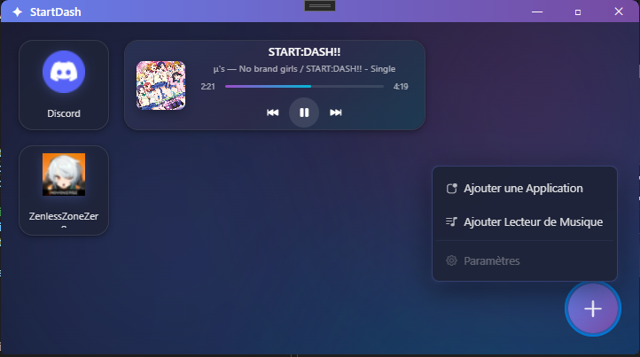

# 🚀 StartDash

**StartDash** is a modern, modular dashboard and desktop widget for Windows. Built with **C#** and powered by **WebView2**, it combines the performance of a desktop application with the aesthetic flexibility of web technologies.

---

## ✨ Features

* **📦 Application Launcher:** Quickly launch your favorite apps (Discord, Zenless Zone Zero, etc.) via dedicated, clean widgets.
* **🎵 Integrated Media Controller:** Real-time music playback control, including track information, progress bars, and playback toggles.
* **🎨 Fluent Design:** A sleek, translucent interface featuring glassmorphism effects that blend perfectly with Windows 11.
* **➕ Extensible System:** Easily add new application shortcuts or media players through an intuitive "+" menu.
* **🪟 Widget Mode:** Designed to stay accessible on your desktop as a functional, non-intrusive companion.

## 🛠️ Tech Stack

* **Backend:** C# (.NET)
* **Frontend Engine:** Microsoft Edge WebView2
* **UI/UX:** HTML5, CSS3 (Advanced Glassmorphism), and JavaScript.
* **Platform:** Windows 10 / 11.

## 📅 Project Status

> [!IMPORTANT]
> **Active Development:** This project is currently in its early development phase. The source code is not yet public, but it is being updated frequently.

### 🗺️ Roadmap
- [ ] Implement widget drag-and-drop & resizing.
- [ ] Add support for dynamic system themes (Light/Dark/Accent).
- [ ] Add system tray integration for background execution.

---

## 🤝 Community & Support

Even though the source code is currently private, I would love to hear your thoughts! 

- **Suggestions:** Open an [Issue](https://github.com/YOUR_USERNAME/StartDash/issues) to propose new widgets or UI improvements.
- **Updates:** Star this repository to stay notified about the first public Alpha release.

---

*Developed with ❤️ for the Windows community.*
